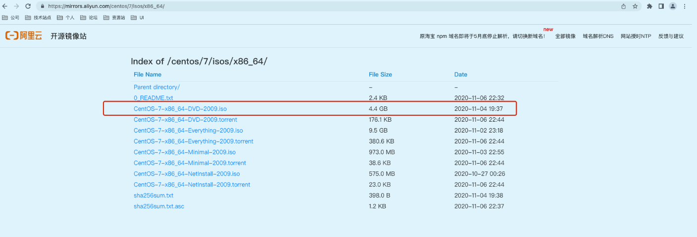
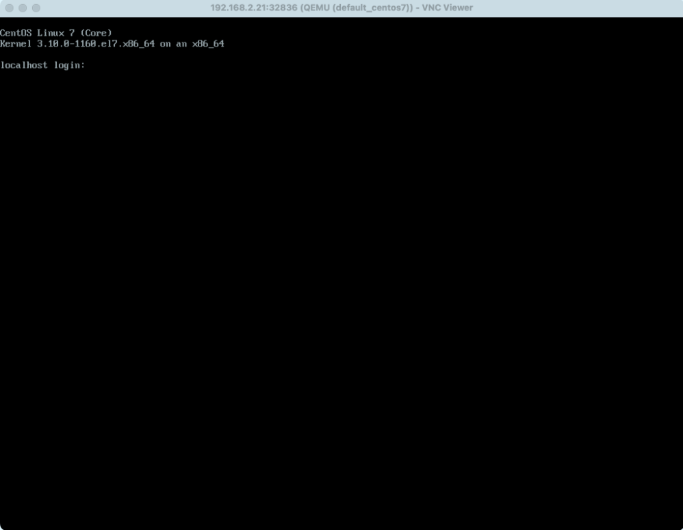

# Kubevirt系列一：虚拟机CentOS7部署实践

俗话说，实践是检验真理的唯一标准，不妨让我们尝试用kubeVirt部署一台属于自己的虚拟机吧~

## 准备环境

首先，我们需要安装`libvirt`和`qemu`，

```shell
yum install -y qemu-kvm libvirt virt-install bridge-utils
```

查看节点是否支持 kvm 虚拟机化

```bash
$ virt-host-validate qemu
  QEMU: 正在检查 for hardware virtualization                           : PASS
  QEMU: 正在检查 if device /dev/kvm exists                             : PASS
  QEMU: 正在检查 if device /dev/kvm is accessible                      : PASS
  QEMU: 正在检查 if device /dev/vhost-net exists                       : PASS
  QEMU: 正在检查 if device /dev/net/tun exists                         : PASS
  QEMU: 正在检查 for cgroup 'memory' controller support                : PASS
  QEMU: 正在检查 for cgroup 'memory' controller mount-point            : PASS
  QEMU: 正在检查 for cgroup 'cpu' controller support                   : PASS
  QEMU: 正在检查 for cgroup 'cpu' controller mount-point               : PASS
  QEMU: 正在检查 for cgroup 'cpuacct' controller support               : PASS
  QEMU: 正在检查 for cgroup 'cpuacct' controller mount-point           : PASS
  QEMU: 正在检查 for cgroup 'cpuset' controller support                : PASS
  QEMU: 正在检查 for cgroup 'cpuset' controller mount-point            : PASS
  QEMU: 正在检查 for cgroup 'devices' controller support               : PASS
  QEMU: 正在检查 for cgroup 'devices' controller mount-point           : PASS
  QEMU: 正在检查 for cgroup 'blkio' controller support                 : PASS
  QEMU: 正在检查 for cgroup 'blkio' controller mount-point             : PASS
  QEMU: 正在检查 for device assignment IOMMU support                   : WARN (No ACPI DMAR table found, IOMMU either disabled in BIOS or not supported by this hardware platform)
```

如果不支持，则让 Kubevirt 使用软件虚拟化：

```bash
kubectl create namespace kubevirt
kubectl create configmap -n kubevirt kubevirt-config --from-literal debug.useEmulation=true
```

开始部署最新版本的kubeVirt，

```bash
export VERSION=$(curl -s https://api.github.com/repos/kubevirt/kubevirt/releases | grep tag_name | grep -v -- '-rc' | head -1 | awk -F': ' '{print $2}' | sed 's/,//' | xargs)
kubectl apply -f https://github.com/kubevirt/kubevirt/releases/download/${VERSION}/kubevirt-operator.yaml
kubectl apply -f https://github.com/kubevirt/kubevirt/releases/download/${VERSION}/kubevirt-cr.yaml
```

查看命令执行结果

```bash
$ kubectl get pods -n kubevirt
NAME                               READY   STATUS    RESTARTS      AGE
virt-api-59d4c5cb49-6b2r2          1/1     Running   1 (82m ago)   82m
virt-api-59d4c5cb49-d9w4z          1/1     Running   1 (82m ago)   82m
virt-controller-8684f9db98-d6w6p   1/1     Running   0             82m
virt-controller-8684f9db98-hrkjg   1/1     Running   0             82m
virt-handler-2hfxz                 1/1     Running   0             82m
virt-handler-4vk84                 1/1     Running   0             82m
virt-handler-qg4qt                 1/1     Running   0             82m
virt-handler-qnzsh                 1/1     Running   0             82m
virt-operator-5fcd4ff76f-47n27     1/1     Running   0             84m
virt-operator-5fcd4ff76f-kq4h8     1/1     Running   0             84m
```

接着我们部署CDI，CDI (Containerized Data Importer) 可以使用 PVC 作为 KubeVirt VM 磁盘，建议同时安装：

```bash
export VERSION=$(curl -s https://github.com/kubevirt/containerized-data-importer/releases | grep -o "v[0-9]\.[0-9]*\.[0-9]*" | head -1)
kubectl create -f https://github.com/kubevirt/containerized-data-importer/releases/download/$VERSION/cdi-operator.yaml
kubectl create -f https://github.com/kubevirt/containerized-data-importer/releases/download/$VERSION/cdi-cr.yaml
```

安装`virtctl`工具，virtctl 工具可以直接用来操作虚拟机，执行以下命令下载，

```bash
export VERSION=$(curl -s https://api.github.com/repos/kubevirt/kubevirt/releases | grep tag_name | grep -v -- '-rc' | head -1 | awk -F': ' '{print $2}' | sed 's/,//' | xargs)
curl -L -o /usr/local/bin/virtctl https://github.com/kubevirt/kubevirt/releases/download/$VERSION/virtctl-$VERSION-linux-amd64
chmod +x /usr/local/bin/virtctl
```

## 部署虚拟机CentOS7

### 准备系统镜像

下载 CentOS7 镜像，选择阿里云镜像站 [https://mirrors.aliyun.com/centos/7/isos/x86_64/](https://mirrors.aliyun.com/centos/7/isos/x86_64/)

{ loading=lazy }

### 上传镜像文件

KubeVirt 可以使用 PVC 作为后端磁盘，使用 `filesystem` 类型的 PVC 时，默认使用的时 `/disk.img` 这个镜像，用户可以将镜像上传到 PVC， 在创建 VMI 时使用此 PVC。使用这种方式需要注意下面几点：

- 一个 PVC 只允许存在一个镜像，只允许一个 VMI 使用，要创建多个 VMI，需要上传多次
- `/disk.img` 的格式必须是 RAW 格式

CDI 提供了使用使用 PVC 作为虚拟机磁盘的方案，在虚拟机启动前通过下面方式填充 PVC：

- 通过 URL 导入虚拟机镜像到 PVC，URL 可以是 http 链接，s3 链接
- Clone 一个已经存在的 PVC
- 通过 container registry 导入虚拟机磁盘到 PVC，需要结合 `ContainerDisk` 使用
- 通过客户端上传本地镜像到 PVC

通过命令行 `virtctl`，结合 CDI 项目，可以上传本地镜像到 PVC 上，支持的镜像格式有：

- `.img`
- `.qcow2`
- `.iso`
- 压缩为 `.tar`，`.gz`，`.xz` 格式的上述镜像

上传镜像文件

```bash
$  export CDI_PROXY=`kubectl -n cdi get svc -l cdi.kubevirt.io=cdi-uploadproxy -o go-template --template='{{ (index .items 0).spec.clusterIP }}'`
$ virtctl image-upload --image-path='/root/iso/CentOS-7-x86_64-DVD-2009.iso' --pvc-name=iso-centos7  --pvc-size=5G --uploadproxy-url=https://$CDI_PROXY  --insecure  --wait-secs=240
PVC default/iso-centos7 not found
PersistentVolumeClaim default/iso-centos7 created
Waiting for PVC iso-centos7 upload pod to be ready...
Pod now ready
Uploading data to https://10.98.254.51

 4.39 GiB / 4.39 GiB [=============================================================================================================================================================] 100.00% 3m43s

Uploading data completed successfully, waiting for processing to complete, you can hit ctrl-c without interrupting the progress
Processing completed successfully
Uploading /root/iso/CentOS-7-x86_64-DVD-2009.iso completed successfully
```

参数说明：

- `–image-path` : 操作系统镜像路径。
- `–pvc-name` : 指定存储操作系统镜像的 PVC，这个 PVC 不需要提前准备好，镜像上传过程中会自动创建。
- `–pvc-size` : PVC 大小，根据操作系统镜像大小来设定，一般略大一个 G 就行。
- `–uploadproxy-url` : `cdi-uploadproxy` 的 Service IP，可以通过命令 `kubectl -n cdi get svc -l cdi.kubevirt.io=cdi-uploadproxy` 来查看。

### 启动HostDisk特性门控

kubeVirt支持`HostDisk`

```bash
$ kubectl edit kubevirt kubevirt -n kubevirt
    ...
    spec:
      configuration:
        developerConfiguration:
          featureGates:
            - DataVolumes
            - HostDisk
    ...
```

### 编排CentOS7虚拟机模板文件

:::details `kubevirt-centos7.yaml`
```yaml title="kubevirt-centos7.yaml"
apiVersion: kubevirt.io/v1
kind: VirtualMachine
metadata:
  name: centos7
spec:
  running: false
  template:
    metadata:
      labels:
        kubevirt.io/domain: centos7
    spec:
      domain:
        cpu:
          cores: 1
        devices:
          disks:
          - bootOrder: 1
            cdrom:
              bus: sata
            name: cdromiso
          - disk:
              bus: virtio
            name: harddrive
          - cdrom:
              bus: sata
            name: virtiocontainerdisk
          interfaces:
          - masquerade: {}
            name: default
        machine:
          type: q35
        resources:
          requests:
            memory: 2G
      networks:
      - name: default
        pod: {}
      volumes:
      - name: cdromiso
        persistentVolumeClaim:
          claimName: iso-centos7
      - name: harddrive
        hostDisk:
          capacity: 30Gi
          path: /data/disk.img
          type: DiskOrCreate
      - containerDisk:
          image: kubevirt/virtio-container-disk
        name: virtiocontainerdisk
```
:::

这里用到了 3 个 Volume：

- `cdromiso` : 提供操作系统安装镜像，即上文上传镜像后生成的 PVC iso-centos7。
- `harddrive` : 虚拟机使用的磁盘，即操作系统就会安装在该磁盘上。这里选择 `hostDisk` 直接挂载到宿主机以提升性能，如果使用分布式存储则体验非常不好。
- `containerDisk` : 由于 Windows 默认无法识别 `raw` 格式的磁盘，所以需要安装 `virtio` 驱动。 `containerDisk` 可以将打包好 `virtio` 驱动的容器镜像挂载到虚拟机中。

关于网络部分，`spec.template.spec.networks` 定义了一个网络叫 `default`，这里表示使用 Kubernetes 默认的 CNI。`spec.template.spec.domain.devices.interfaces` 选择定义的 网络 `default`，并开启 `masquerade`，以使用网络地址转换 (NAT) 来通过 Linux 网桥将虚拟机连接至 Pod 网络后端。

编排模板文件，

```bash
kubectl apply -f kubevirt-centos7.yaml
```

### 启动虚拟机和vnc代理

启动虚拟机，

```bash
virtctl start centos7
```

启动vnc代理，

```bash
$ virtctl vnc centos7 --proxy-only --address=0.0.0.0
{"port":42743}
{"component":"","level":"info","msg":"connection timeout: 1m0s","pos":"vnc.go:153","timestamp":"2022-06-07T10:06:11.066704Z"}
{"component":"","level":"info","msg":"VNC Client connected in 7.866330333s","pos":"vnc.go:166","timestamp":"2022-06-07T10:06:18.933070Z"}
```

执行完上面的命令后，就会打开本地的 VNC 客户端连接到虚拟机，

{ loading=lazy }

直接下一步直到完成即可。安装完成重启后虚拟机依旧会从 `cdrom` 启动，修改 vm，

```bash
virtctl stop centos7
kubectl edit virtualmachine.kubevirt.io/centos7
```

设硬盘为第一启动项，

```bash
...
        devices:
          disks:
          - bootOrder: 2
            cdrom:
              bus: sata
            name: cdromiso
          - bootOrder: 1
            disk:
              bus: virtio
            name: harddrive
...
```

修改完成，重启虚拟机

```bash
virtctl start centos7
```

centOS7 虚拟机启动正常。

{ loading=lazy }