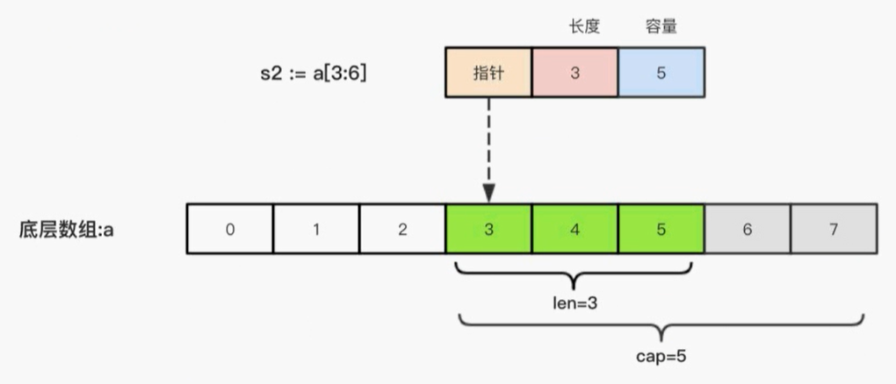

# Go 基础知识系列一: 数组与切片

这篇文章总结了 Go 的知识体系数组与切片，包括其中的底层实现等等。

:::warning 注意
说起 Golang， 大家都会第一时间想到高并发和 Golang 作为主流的后端开发语言的优势，本文主要讲 Golang 主要知识体系，包括**数组和切片**、**协程的调度**原理、等待组 **waitGroup**、**channel** 的底层实现、互斥锁 **mutex** 的实现、**interface** 中的多态等等。
:::

## 数组和切片

### 切片的本质

切片的本质就是对底层数组的封装，它包含了三个信息

- 底层数组的指针
- 切片的长度(len)
- 切片的容量(cap)

切片的容量指的是**数组中的头指针指向的位置至数组最后一位的长度**。举个例子，现在有一个数组 `a := [8]int {0,1,2,3,4,5,6,7}`，切片 `s1 := a[:5]`，相应示意图如下


切片 `s2 := a[3:6]`，相应示意图如下：



### 切片的扩容

Go 中切片扩容的策略是这样的：

- 如果切片的容量小于 1024 个元素，于是扩容的时候就翻倍增加容量。上面那个例子也验证了这一情况，总容量从原来的4个翻倍到现在的8个。
- 一旦元素个数超过 1024 个元素，那么增长因子就变成 1.25 ，即每次增加原来容量的四分之一。

:::tip 一点说明
扩容扩大的容量都是针对原来的容量而言的，而不是针对原来数组的长度而言的。
:::

> [!IMPORTANT] 举例
> ```go
> // make()函数创建切片
> fmt.Println()
> var slices = make([]int, 4, 8)
> //[0 0 0 0]
> fmt.Println(slices)
> // 长度：4, 容量8
> fmt.Printf("长度：%d, 容量%d", len(slices), cap(slices))
> ```

需要注意的是，golang 中没办法通过下标来给切片扩容，如果需要扩容，需要用到 `append`

```go
slices2 := []int{1,2,3,4}
slices2 = append(slices2, 5)
fmt.Println(slices2)
// 输出结果 [1 2 3 4 5]
```

同时切片还可以将两个切片进行合并

```go
// 合并切片
slices3 := []int{6,7,8}
slices2 = append(slices2, slices3...)
fmt.Println(slices2)
// 输出结果  [1 2 3 4 5 6 7 8]
```


### 切片的传递问题

切片本身传递给函数形参时是引用传递，但 `append` 后，切片长度变化时会被重新分配内存，而原来的切片还是指向原来地址，致使与初始状况传进来的地址不一样，要想对其值有改变操作，需使用指针类型操作。

我们来看一道 leetcode 78:

:::details 给你一个整数数组 nums ，数组中的元素 互不相同 。返回该数组所有可能的子集（幂集）。<br><br> 解集 不能 包含重复的子集。你可以按 任意顺序 返回解集。<br><br> 示例1：<br><br> 输入：`nums = [1,2,3]` <br> 输出：`[[],[1],[2],[1,2],[3],[1,3],[2,3],[1,2,3]]` <br><br> 示例 2：<br><br> 输入：`nums = [0]` <br> 输出：`[[],[0]]`<br><br><br> 提示：<br><ul><li>`1 <= nums.length <= 10` </li><li> `-10 <= nums[i] <= 10`</li><li> `nums` 中的所有元素 互不相同</li></ul>
```go

package main

import "fmt"

func helper(nums []int, res *[][]int, tmp []int, level int) {
	if len(tmp) <= len(nums) {
		//长度一样的tmp用的是同一个地址，故可能会存在覆盖值得情况，
		// 长度不一样时重新开辟空间，将已有得元素复制进去
		//*res = append(*res, tmp) 如此处，最终长度为1的tmp会被最后3这个元素全部覆盖
		//以下相当于每次重新申请内存，使其指向的地址不一样，解决了最后地址一样的元素值被覆盖的状态状态
		var a []int
		a = append(a, tmp[:] ...)
		//res = append(res, a) 如果此处不是指针引用传递，在append后，res重新分配内存，与之前传进来的res地址不一样，最终res仍为空值
		*res = append(*res, a)
	}
	//fmt.Println(*res, "--->", tmp)
	for i := level; i < len(nums); i ++ {
		tmp = append(tmp, nums[i])
		helper(nums, res, tmp, i + 1)
		tmp = tmp[:len(tmp) - 1] //相当于删除tmp末位的最后一个元素
	}
}

func subsets(nums []int) [][]int {
	if len(nums) == 0 {
		return nil
	}
	var res [][]int
	var tmp []int
	helper(nums, &res, tmp, 0)
	return res
}


func main()  {
	pre := []int{1, 2, 3}
	fmt.Println(subsets(pre))
}
//错误结果：[[] [3] [1 3] [1 2 3] [1 3] [3] [2 3] [3]]， 可以看出，长度为1的切片都被3覆盖了，这由于它们的地址不一样
//正确输出：[[] [1] [1 2] [1 2 3] [1 3] [2] [2 3] [3]]， 这是因为每次都为a分配内存，其地址都与之前的不一样，故最终的值没有被覆盖
```
:::
